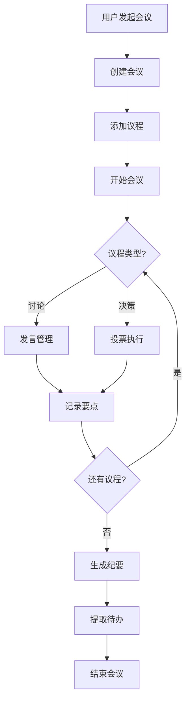

# Multi-Agent Meeting System

> 多Agent协同会议系统 - 让AI Agent们像团队一样协作开会

[](LICENSE)
[](https://nodejs.org/)
[](https://www.typescriptlang.org/)

## 项目简介

Multi-Agent Meeting System 是基于 [OpenClaw](https://github.com/openclaw/openclaw) 平台开发的多Agent协同会议系统。它让多个AI Agent能够像人类团队一样，进行有序的会议讨论、投票决策和产出归档。

### 核心能力

- 🎯 **会议协调**：自动管理议程、协调发言、控制节奏
- 🗳️ **投票决策**：支持多种投票模式，自动统计结果
- 📝 **纪要生成**：自动记录会议要点，生成结构化纪要
- ✅ **待办提取**：识别待办事项，明确责任人和截止时间
- 🔄 **场景模板**：内置头脑风暴、需求评审、技术评审、项目启动等场景

### 适用场景

| 场景 | 描述 |
|------|------|
| 头脑风暴 | 多Agent创意收集、归类、优先级投票 |
| 需求评审 | PRD文档分项审议、决议生成 |
| 技术评审 | 多维度技术方案评估、风险识别 |
| 项目启动 | 目标对齐、团队分工、里程碑规划 |

## 项目结构

```
multi-agent-meeting-system/
├── plugin/                      # OpenClaw 插件
│   ├── src/                     # 源代码
│   │   ├── index.ts             # 插件入口
│   │   ├── tools/               # 工具实现
│   │   │   ├── meeting-*.ts     # 会议管理工具
│   │   │   ├── agenda-tools.ts  # 议程管理工具
│   │   │   ├── speaking-tools.ts# 发言管理工具
│   │   │   ├── voting-tools.ts  # 投票管理工具
│   │   │   ├── recording-tools.ts# 会议记录工具
│   │   │   └── output-tools.ts  # 输出生成工具
│   │   ├── modules/             # 功能模块
│   │   │   ├── communication/   # 通信层
│   │   │   └── meeting/         # 会议存储
│   │   ├── types/               # 类型定义
│   │   └── utils/               # 工具函数
│   ├── tests/                   # 测试用例
│   ├── package.json
│   ├── tsconfig.json
│   └── openclaw.plugin.json     # 插件配置
│
└── skill/                       # Agent技能文档
    ├── SKILL.md                 # 主技能文档
    ├── scenarios/               # 场景模板
    │   ├── brainstorm.md        # 头脑风暴
    │   ├── requirement-review.md# 需求评审
    │   ├── technical-review.md  # 技术评审
    │   └── project-kickoff.md   # 项目启动
    ├── templates/               # 会议模板
    │   ├── agenda-templates.md  # 议程模板库
    │   └── voting-rules.md      # 投票规则配置
    └── examples/                # 示例
        └── sample-meeting-flow.md
```

## 技术架构

### Plugin工具集（22个工具）

| 类别 | 工具 | 说明 |
|------|------|------|
| **会议管理** | `meeting_create` | 创建会议 |
| | `meeting_start` | 开始会议 |
| | `meeting_end` | 结束会议 |
| | `meeting_get` | 获取会议详情 |
| | `meeting_list` | 列出会议列表 |
| **议程管理** | `agenda_add_item` | 添加议程项 |
| | `agenda_list_items` | 列出议程 |
| | `agenda_next_item` | 下一议程项 |
| **发言管理** | `speaking_request` | 请求发言 |
| | `speaking_grant` | 授权发言 |
| | `speaking_release` | 释放发言权 |
| | `speaking_status` | 查看发言状态 |
| **投票管理** | `voting_create` | 创建投票 |
| | `voting_cast` | 投票 |
| | `voting_get_result` | 获取投票结果 |
| | `voting_end` | 结束投票 |
| | `voting_override` | 覆盖投票结果 |
| **会议记录** | `recording_take_note` | 记录笔记 |
| | `recording_tag_insight` | 标记洞察 |
| | `recording_get_transcript` | 获取记录 |
| **输出生成** | `output_generate_summary` | 生成纪要 |
| | `output_generate_action_items` | 提取待办 |
| | `output_export` | 导出会议 |

### 技术栈

| 组件 | 技术 | 说明 |
|------|------|------|
| 语言 | TypeScript 5.7 | 类型安全 |
| 运行时 | Node.js 22+ | OpenClaw兼容 |
| 校验 | @sinclair/typebox | Schema校验 |
| 存储 | JSON文件 | 会议数据持久化 |
| 测试 | Vitest | 单元测试/集成测试 |

## 快速开始

### 环境要求

- Node.js >= 22.0.0
- OpenClaw >= 1.0.0

### 安装

```bash
# 克隆仓库
git clone https://github.com/aoyasong/multi-agent-meeting-system.git
cd multi-agent-meeting-system

# 安装依赖
cd plugin
npm install

# 编译
npm run build
```

### 配置

在 OpenClaw 配置中添加插件：

```json
{
  "plugins": {
    "entries": [
      {
        "id": "meeting",
        "path": "./path/to/multi-agent-meeting-system/plugin"
      }
    ]
  }
}
```

### 使用

1. **安装Skill文档**：将 `skill/` 目录复制到 `~/.openclaw/skills/multi-agent-meeting/`

2. **在对话中使用**：
   ```
   用户: 我们来头脑风暴一下新产品命名
   用户: 评审一下积分系统PRD
   用户: 启动一个技术评审会议
   ```

## 配置项

| 参数 | 默认值 | 说明 |
|------|--------|------|
| `storageDir` | `~/.openclaw/meetings` | 会议数据存储目录 |
| `pollIntervalMs` | 5000 | 消息轮询间隔（毫秒） |
| `agentTimeoutMs` | 30000 | Agent响应超时（毫秒） |
| `votingWindows.simple` | 180 | 简单决策投票窗口（秒） |
| `votingWindows.moderate` | 300 | 中等复杂度投票窗口（秒） |
| `votingWindows.complex` | 600 | 复杂决策投票窗口（秒） |

## 开发

### 构建

```bash
cd plugin
npm run build
```

### 测试

```bash
cd plugin
npm test              # 运行测试
npm run test:coverage # 测试覆盖率
```

### 开发模式

```bash
cd plugin
npm run build:watch   # 监听模式编译
```

## 核心工作流



## 扩展开发

### 添加新场景

1. 在 `skill/scenarios/` 创建场景文档
2. 定义场景触发条件、流程模板、话术示例
3. 在 `skill/SKILL.md` 中引用新场景

### 添加新工具

1. 在 `plugin/src/tools/` 创建工具文件
2. 实现工具逻辑和类型定义
3. 在 `plugin/src/index.ts` 注册工具
4. 更新 `openclaw.plugin.json`

## 贡献指南

欢迎提交 Issue 和 Pull Request！

1. Fork 本仓库
2. 创建特性分支 (`git checkout -b feature/AmazingFeature`)
3. 提交更改 (`git commit -m 'Add some AmazingFeature'`)
4. 推送到分支 (`git push origin feature/AmazingFeature`)
5. 提交 Pull Request

## 许可证

[MIT License](LICENSE)

## 相关链接

- [OpenClaw](https://github.com/openclaw/openclaw) - AI Agent 平台
- [ClawHub](https://clawhub.ai) - Agent Skills 市场
- [文档](https://docs.openclaw.ai) - OpenClaw 文档

## 致谢

本项目基于 OpenClaw 平台开发，感谢 OpenClaw 社区的支持。
