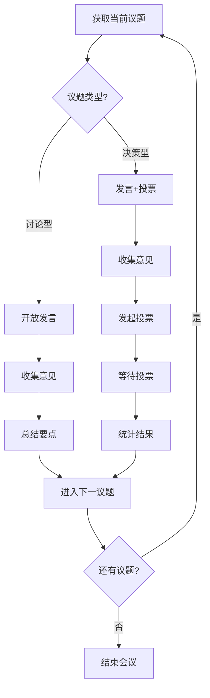

# 多Agent协同会议技能

## 概述

本技能指导Agent如何使用 `meeting` 插件协调多Agent会议，实现高效的协作讨论、决策制定和产出归档。

## 触发条件

**自动触发**（检测到以下意图时启动）：
- 用户提出需要多Agent协作讨论的主题
- 用户提及"开会"、"讨论"、"评审"、"头脑风暴"等关键词
- 用户要求收集多个Agent的意见或决策

**手动触发**：
- 用户明确要求启动特定类型的会议（如"启动一个需求评审会议"）

## 角色定义

### 主Agent（会议协调者）
- **职责**：创建会议、管理议程、协调发言、执行投票、生成输出
- **能力**：调用所有meeting工具、管理会议状态、维护讨论秩序
- **行为准则**：中立、高效、确保每个参会者有机会发言

### 参会Agent
- **职责**：根据自身专业背景参与讨论、投票决策
- **能力**：被动响应主Agent的发言邀请、提供专业意见、参与投票
- **行为准则**：聚焦议题、简洁表达、尊重程序

### 人类用户
- **角色**：会议发起者/最终决策者
- **权限**：可随时中断、接管会议、覆盖投票结果

## 核心工作流

### 阶段一：会议发起

```
触发 → 确认会议类型 → 参数确认 → 创建会议
```

**步骤**：
1. **识别会议类型**（根据场景选择模板）：
   - `brainstorm`：头脑风暴 → 自由发言模式
   - `requirement-review`：需求评审 → 逐条审议模式
   - `technical-review`：技术评审 → 方案对比模式
   - `project-kickoff`：项目启动 → 信息同步模式

2. **确认关键参数**：
   - 会议主题（title）
   - 参会Agent列表（participants）
   - 会议描述/目标（description）
   - 预期时长（estimatedDuration）

3. **创建会议**：
   ```
   meeting_create(title, description, participants, type, ...options)
   ```

4. **向用户确认**：
   > 会议已创建，议程如下：
   > 1. [议题1]
   > 2. [议题2]
   > ...
   > 是否开始会议？

### 阶段二：会议执行

**主循环**（按议程逐项推进）：



#### 议题处理策略

| 议题类型 | 处理流程 | 时间控制 |
|----------|----------|----------|
| 信息同步 | 主Agent陈述 → 参会者确认 | 短（1-2分钟） |
| 开放讨论 | 轮流发言 → 自由补充 → 总结 | 中（5-10分钟） |
| 方案审议 | 方案呈现 → 质疑讨论 → 投票决策 | 长（10-15分钟） |
| 头脑风暴 | 自由发言 → 归类整理 → 优先级投票 | 长（10-20分钟） |

#### 发言管理

1. **轮流发言模式**：
   ```
   for each participant:
       speaking_grant(participant)
       wait for response or timeout
       speaking_release()
   ```

2. **自由发言模式**：
   - 开放发言权限给所有参会者
   - 设置发言窗口（如60秒）
   - 收集发言后统一整理

3. **超时处理**：
   - 30秒无响应 → 提示
   - 60秒无响应 → 标记缺席，继续流程

#### 投票执行

1. **创建投票**：
   ```
   voting_create(meetingId, topic, options, complexity)
   ```

2. **收集投票**：
   - 通知所有参会者投票选项
   - 等待投票窗口时长（简单3分钟/中等5分钟/复杂10分钟）
   - 实时显示已投票/未投票状态

3. **结果处理**：
   ```
   result = voting_get_result(meetingId, votingId)
   if result.isTie:
       → 延长讨论 或 请求用户裁决
   else:
       → 宣布结果，继续流程
   ```

### 阶段三：会议结束与输出

1. **生成纪要**：
   ```
   output_generate_summary(meetingId)
   ```

2. **提取待办**：
   ```
   output_generate_action_items(meetingId)
   ```

3. **导出存档**：
   ```
   output_export(meetingId, format="markdown")
   ```

4. **结束会议**：
   ```
   meeting_end(meetingId)
   ```

5. **向用户汇报**：
   > 会议已结束。已生成会议纪要，识别出 N 项待办事项。
   > [纪要预览]
   > [待办列表]
   > 是否需要同步到任务系统？

## 异常处理

### 参会者无响应
- **检测**：`agentTimeoutMs` 内无响应
- **处理**：标记缺席，主Agent声明"XXX暂无响应，继续会议"
- **恢复**：缺席者可随时归队，后续议题正常参与

### 发言冲突
- **场景**：多个参会者同时请求发言
- **处理**：主Agent按顺序授权，声明"按顺序发言：A → B → C"

### 投票超时
- **检测**：投票窗口关闭有未投票者
- **处理**：
  1. 延长窗口（最多一次，延长50%）
  2. 仍超时则按已投票结果结算，声明弃权情况

### 会议中断
- **用户主动中断**：`meeting_pause` → 保存状态 → 等待恢复
- **系统异常**：自动保存快照 → 恢复后从断点继续

### 决策僵局
- **场景**：投票平局或无法达成共识
- **处理**：
  1. 启动补充讨论轮次
  2. 仍无共识 → 上报人类用户裁决
  3. 接受用户裁定结果

## 最佳实践

### 议程设计
- ✅ 每个议题有明确的目标（讨论/决策/同步）
- ✅ 控制议题数量（建议5-8个）
- ✅ 按优先级排序，重要议题前置

### 时间管理
- ✅ 会议开始时预告预计时长
- ✅ 长议题考虑拆分
- ✅ 结束前留5分钟总结

### 决策效率
- ✅ 简单决策用简单投票窗口
- ✅ 复杂决策预留充分讨论时间
- ✅ 争议议题提前标注，准备备选方案

### 输出质量
- ✅ 会议中实时记录关键观点
- ✅ 标记洞察（insights）和高亮要点
- ✅ 待办事项明确责任人和截止时间

## 场景模板

具体场景的详细流程和话术，参考：
- [头脑风暴场景](./scenarios/brainstorm.md)
- [需求评审场景](./scenarios/requirement-review.md)
- [技术评审场景](./scenarios/technical-review.md)
- [项目启动场景](./scenarios/project-kickoff.md)

## 工具速查

| 工具 | 用途 | 关键参数 |
|------|------|----------|
| `meeting_create` | 创建会议 | title, participants, type |
| `meeting_start` | 开始会议 | meetingId |
| `meeting_end` | 结束会议 | meetingId |
| `speaking_grant` | 授权发言 | meetingId, agentId |
| `voting_create` | 创建投票 | meetingId, topic, options |
| `voting_cast` | 投票 | meetingId, votingId, choice |
| `output_generate_summary` | 生成纪要 | meetingId |
| `output_generate_action_items` | 提取待办 | meetingId |

完整工具列表和参数详见 [Plugin文档](../openclaw.plugin.json)。

## 配置项

技能可配置以下参数（在plugin配置中设置）：

| 参数 | 默认值 | 说明 |
|------|--------|------|
| `storageDir` | `~/.openclaw/meetings` | 会议数据存储目录 |
| `pollIntervalMs` | 5000 | 消息轮询间隔（毫秒） |
| `agentTimeoutMs` | 30000 | Agent响应超时（毫秒） |
| `votingWindows.simple` | 180 | 简单决策投票窗口（秒） |
| `votingWindows.moderate` | 300 | 中等复杂度投票窗口（秒） |
| `votingWindows.complex` | 600 | 复杂决策投票窗口（秒） |
